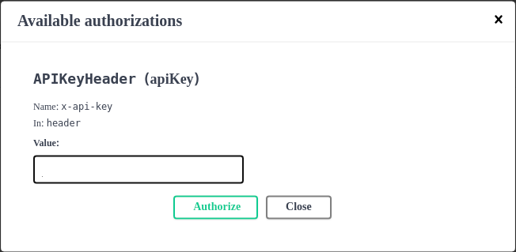

# Description
A pdf parsing web application. [ Deatils will be added as I go with the development. ]

> NOTE: Still a lot of work needs to be done to complete this project. Such as -
- writing tests to achieve good coverage.
- having meaningful work done by endpoints.
- storing api-keys in postgresql.
- kubernetes deployment.

## Update: 14th August, 2021
API Rate Limit Feature Added.

**Details:** `/pdf/extract` endpoint can be access via a valid API_KEY. A user with valid API_KEY can access this endpoint 20 times per minute. If he crosses the limit, he won't be able to access the endpoint any longer and have to wait for the next term.

**feature specific branch:** `task/jabertuhin/api-rate-limiter-with-redis`

## How to run locally (on linux machine)

**step 1:** Clone this repository into your local machine.

`git clone https://github.com/jabertuhin/fastapi-with-redis.git`

**step 2:** Enter into project root directory and create virtual environment. And activate it.

```
cd fastapi-with-redis
virtualenv venv
source venv/bin/activate
```

**step 3:** Installing application dependencies(including test dependencies).

`make dev_setup`

**step 4:** Run redis server with docker. (Assuming docker daemon is running.) This may take some time, depending on redis docker image availability on your pc.

`docker run -p 6379:6379 redis`

**step 5:** Run fastapi application with gunicorn server from project root(gunicorn doesn't run on windows machine).

`make server`

**step 6:** From your web browser visit `http://0.0.0.0:8080/docs` and this will load swagger UI.

To access `/health` endpoint, you won't need any input or api_key.

But to access `/pdf/extract` endpoint, you need to provide valid api_key.

valid api keys: `["x189-0sf0", "0nmsd82sdf", "0ijnsd89"]`

In the top right corner, you will see a **Authorize** button, and clicking it will promt a input form like this -



Provide valid api-key to get successful response, and to check authentication you can provide random api-keys. 

> NOTE: This api-key checking is a dummy implementation.


## References
- [Asynchronous Tasks with Flask and Redis Queue](https://testdriven.io/blog/asynchronous-tasks-with-flask-and-redis-queue/)
- [Asynchronous Tasks in Python with Redis Queue](https://www.twilio.com/blog/asynchronous-tasks-in-python-with-redis-queue)
- [FastAPI + Redis example](https://python-dependency-injector.ets-labs.org/examples/fastapi-redis.html)
- [aioredis](https://github.com/aio-libs/aioredis-py)
- [Spin up Redis on Docker and learn basic commands](https://youtu.be/ZkwKyUZWkp4)

### PostgreSQL, SqlAlchemy
- [PostgreSQL](https://www.fullstackpython.com/postgresql.html)
- [Schema migrations with Alembic, Python and PostgreSQL](https://www.compose.com/articles/schema-migrations-with-alembic-python-and-postgresql/)
- [Using PostgreSQL through SQLAlchemy](https://www.compose.com/articles/using-postgresql-through-sqlalchemy/)
- [Async SQL (Relational) Databases](https://fastapi.tiangolo.com/advanced/async-sql-databases/)

### Redis
- [aioredis — API Reference](https://aioredis.readthedocs.io/en/v1.3.0/api_reference.html)
- [High Level APIs](https://aioredis.readthedocs.io/en/latest/api/high-level/)
- [Basic Rate Limiting](https://redislabs.com/redis-best-practices/basic-rate-limiting/)
- [redis-developer/basic-rate-limiting-demo-python](https://github.com/redis-developer/basic-rate-limiting-demo-python)
- [Using Redis with FastAPI](https://developer.redislabs.com/develop/python/fastapi/)
- [Scheduling Tasks in Python with Redis Queue and RQ Scheduler](https://www.twilio.com/blog/scheduling-tasks-in-python-with-redis-queue-and-rq-scheduler)
- [Redis Queue (RQ)](https://www.fullstackpython.com/redis-queue-rq.html)
- [Beyond the Cache with Python](https://redis.com/blog/beyond-the-cache-with-python/)
- [How to Use Redis With Python](https://realpython.com/python-redis/)
- [fakeredis: A fake version of a redis-py](https://github.com/jamesls/fakeredis)


### Logging
- [Unify Python logging for a Gunicorn/Uvicorn/FastAPI application](https://pawamoy.github.io/posts/unify-logging-for-a-gunicorn-uvicorn-app/)